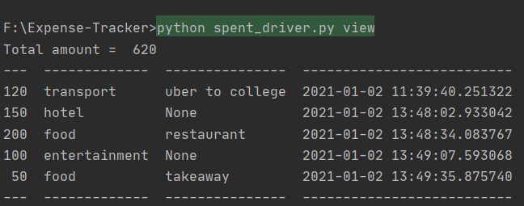

# Expense-Tracker
A simple API for an expense tracking application along with multiple interfaces to use it.

A demonstration of programming with a database and creating an abstracted API, along with various interfaces which use it.

# Requirements

  > Python

  > Docopt

  > Tabulate

  > sqlite3

To install a package , use the following command:
### `pip install <package_name>`

To install the packages at once, use:
### `pip install -r requirements.txt`

# Using the CLI

### `python spent_driver.py init`

Logging an expense:
### `spent_driver.py <amount> <category> [<message>]`
>message is optional

For example:

### `python spent_driver.py 50 food "snacks in the evening"`

Viewing your expenditure:
### `spent_driver.py view [<view_category>]`
>view_category is optional

For example:

### `python spent_driver.py view food`

An example Output:

 
 
Thankyou!
     

     
